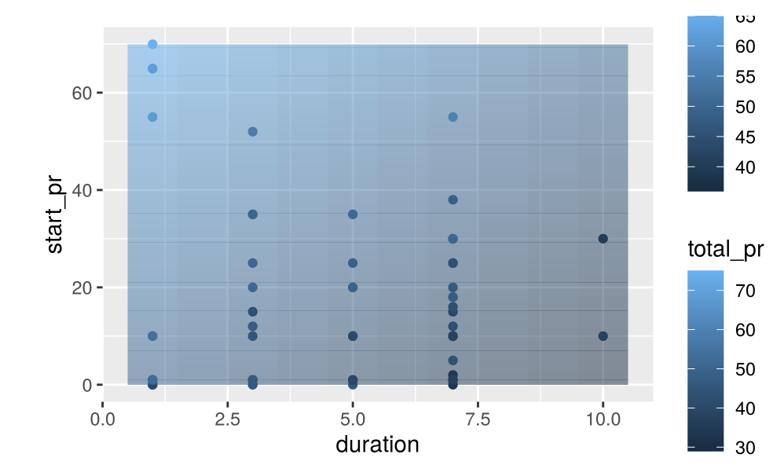
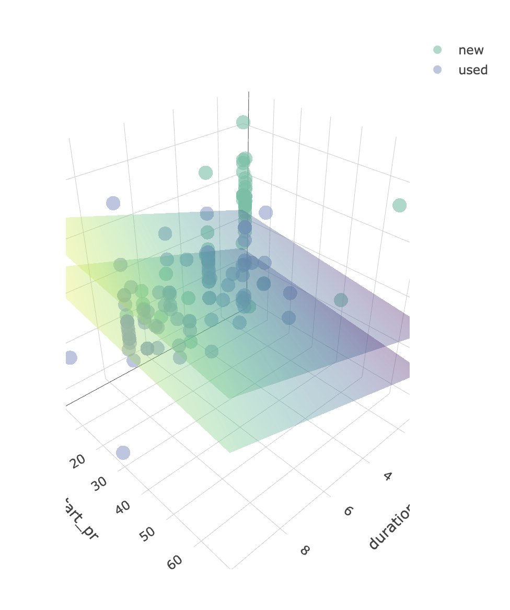

```{r setup, include=FALSE}
knitr::opts_chunk$set(echo = TRUE)
library(tidyverse)
library(tidymodels)
library(GGally)
library(patchwork)
library(ggthemes)
```


# Part 1: COVIDCAST Data

```{r}
covid = read_csv("covid_data.csv")
covid
```

```{r}
covid %>%
  group_by(geo_value, signal) %>%
  summarize(
    avg = mean(value, na.rm = T)
  ) %>%
  pivot_wider(id_cols = geo_value, names_from = signal, values_from = avg) %>%
  ungroup() -> state_avg
state_avg
```

**Make sure to include code and graphs here!**

```{r eda, fig.width = 12, fig.height = 12}
state_avg %>%
  select(-geo_value) %>%
  rename_all(funs(stringr::str_replace(., "smoothed_", ""))) %>%
  GGally::ggpairs()
```

```{r, fig.width = 9}
state_avg %>%
  mutate(state = str_to_upper(geo_value)) %>%
  ggplot(aes(x = smoothed_wearing_mask, y = smoothed_cli)) +
  geom_text(mapping = aes(label = geo_value)) +
  labs(title = "Relationship Between Wearing Masks & Having COVID-like Illness",
       x = "people who wore a mask (%)",
       y = "people with COVID-like illness (%)",
       caption = "SOURCE: Delphi Group") +
  theme_gdocs() +
  theme(plot.title.position = "plot")
```

```{r, fig.width = 9}
state_avg %>%
  mutate(state = str_to_upper(geo_value)) %>%
  ggplot(aes(x = smoothed_wearing_mask, y = smoothed_cli)) +
  geom_text(mapping = aes(label = geo_value)) +
  stat_smooth(method = "lm", se = FALSE) +
  labs(title = "Relationship Between Wearing Masks & Having COVID-like Illness",
       x = "people who wore a mask (%)",
       y = "people with COVID-like illness (%)",
       caption = "SOURCE: Delphi Group") +
  theme_gdocs() +
  theme(plot.title.position = "plot")
```

The four assumptions we have to check in order to do linear regression is: linear relationship, independent observations, normal residuals, and equal variance. In order to check the linear relationship, we can look at the original scatterplot, which is shown above. The only thing that would cause concern would be if the points were in a curved pattern, or anything that wasn't straight/linear. From the scatterplot, the points look "straight enough," so I think this assumption is met.

The second assumption is independent observations. This assumption can be checked by both thinking critically about the data, as well as looking at a plot of the residuals vs predictor value (the bottom left plot). We're looking to make sure there isn't any visible shapes, patterns, relationships, etc. We just want it to look like a cloud. The plot looks good, but I think there is a small concern with the independence assumption: if one state, for example New York, has a higher percentage of people with COVID-like illness, I feel like that would affect the percentage of people with COVID-like illness in nearby states like Pennsylvania and New Jersey. I think this assumption is probably met, but I would proceed with caution here.

The third assumption is normal residuals. This assumption can be checked by looking at the distribution of the residuals (the bottom middle plot). We want to make sure the plot is roughly unimodal, symmetric, and bell-shaped. It looks symmetric and bell-shaped, but it appears to have two modes. However, the modes are very close to each other, and I'm sure if you pick another (smaller) bin size, it will be unimodal. Therefore, I think this assumption is met.

The last assumption is equal variance, and we can check it by looking at the scatterplot of residuals vs fitted values (bottom right plot). We are, again, making sure there isn't any obvious shapes, trends, or relationships, and the points look "like a cloud." I think this assumption is met.

```{r assumptions, fig.width = 9}
lm_mod = lm(smoothed_cli ~ smoothed_wearing_mask, data = state_avg)

lm_res = augment(lm_mod, interval = "prediction") 
p1 = ggplot(lm_res, aes(x = smoothed_wearing_mask, y = .resid)) +
  geom_point() +
  labs(title = "Residuals vs Predictor",
       x = "people who wore a mask (%)",
       y = "residuals") +
  theme_igray()

p2 = ggplot(lm_res, aes(x = .resid)) + 
  geom_histogram(bins = 15) +
  labs(title = "Distribution of Residuals",
       x = "residuals",
       y = "count") +
  theme_igray()

p3 = ggplot(lm_res, aes(x = .fitted, y = .resid)) +
  geom_point() +
  labs(title = "Residuals vs fitted values",
       x = "fitted values",
       y = "residuals") +
  theme_igray()

p1 + p2 + p3
```

```{r}
tidy(lm_mod, conf.int = TRUE)
```

```{r}
ggplot(data = tidy(lm_mod, conf.int = TRUE), mapping = aes(x = estimate, y = term)) +
  geom_pointrange(mapping = aes(xmin = conf.low, xmax = conf.high)) +
  labs(x = "OLS Estimate",
       y = "Term",
       caption = "SOURCE: Delphi Group") +
  theme_gdocs()
```

# Part 2: Multiple Regression Tutorial

Include your screenshots here! 

Here are my two favorite plots:



