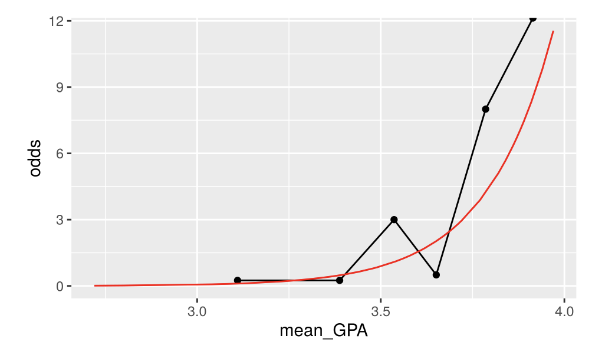

```{r setup, include=FALSE}
knitr::opts_chunk$set(echo = TRUE)
library(tidyverse)
library(tidymodels)
```


# Option 1: Tutorial 

[Tutorial Link](https://openintro.shinyapps.io/ims-04-multivariable-and-logistic-models-04/#section-logistic-regression)

Include Screenshots of your chosen graphs here! 

The graph below shows a scatterplot that with the logistic curve overlayed on top. This is a good way to visualize a logistic regression. It shows what probability a student has of being acceptanced to medical school at a certain GPA. For example, at a GPA of around $3.5$, the probability of getting in is almost $50\%$.


However, the difficulty of logistic regressions is that there's no easy interpretation of the slope because the curve is S-shaped (unlike in a linear regression, where the line is linear). To try and make this easier to interpret, there are three scales we can use. One of them is the odds-scale, and it is shown below. The scale is harder to interpret than the probability scale, as it deals with odds and not probabilities, but the function (shown in red) is exponential and thus easier to interpret than the probability function. The black line shows the odds of getting into med school at certain bins/windows of the GPA, based on the collection of data we currently have/are using.



The last screenshot below shows another scale that can be used when working with logistic regression models: the log-odds scale. The benefit of this scale is that the function is linear and easy to interpret, but the scale itself is impossible to interpret. This means that we can finally say, "With a(n) X increase in GPA, there is an associated change of Y." The problem is that Y is on a log-odds scale, which is honestly a little meaningless to our minds.


