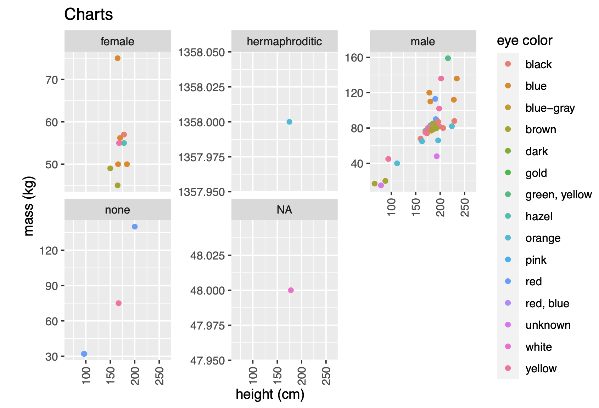
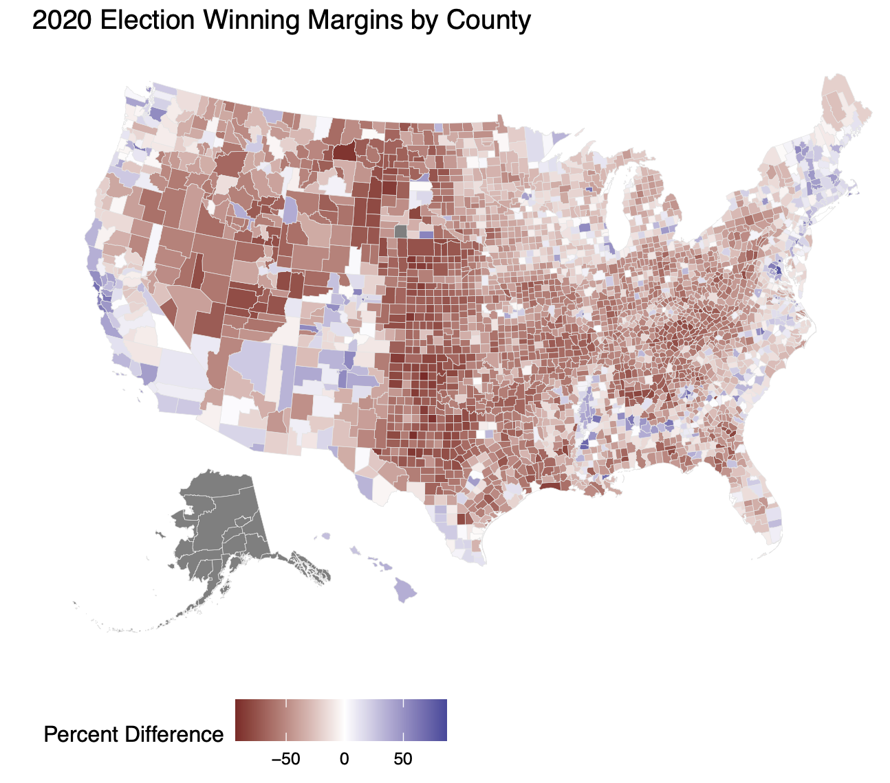
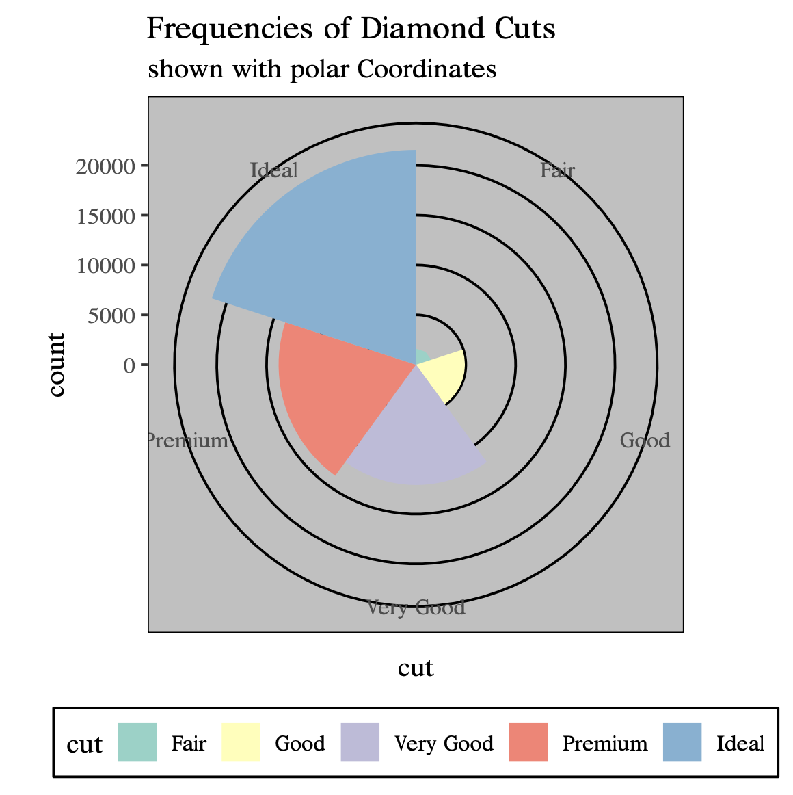
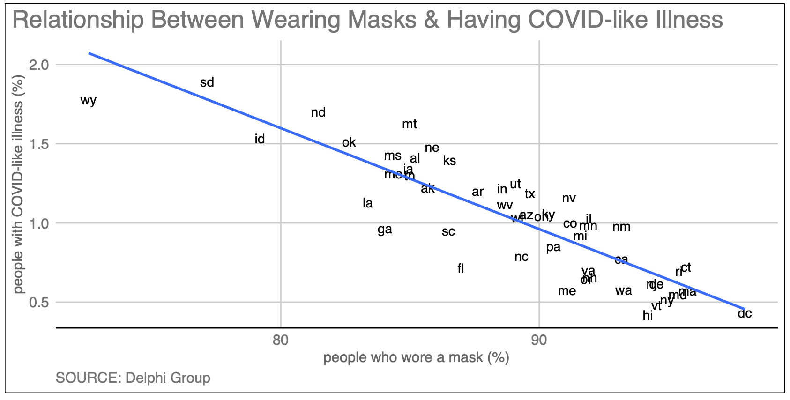

# dataviz-labs

Labs completed for my J-term 2021 (Statistical Graphics and Data Visualization) with Professor Amanda Luby at Swarthmore College.

## Lab 2

[Description](http://www.swarthmore.edu/NatSci/aluby1/stat041/Labs/Lab02.html): Exploring different geoms of ggplot

## Lab 3

[Description](http://www.swarthmore.edu/NatSci/aluby1/stat041/Labs/Lab03.html): Making maps using 2020 election data

## Lab 4

[Description](http://www.swarthmore.edu/NatSci/aluby1/stat041/Labs/Lab04.html): Changing fonts, themes, and color palettes

## Lab 5

[Description](http://www.swarthmore.edu/NatSci/aluby1/stat041/Labs/Lab05-ols.html): Fitting linear regression model to data on COVID-19

## Lab 6

[Description](http://www.swarthmore.edu/NatSci/aluby1/stat041/Labs/Lab06-nonlinear.html): Fitting nonlinear regressions and