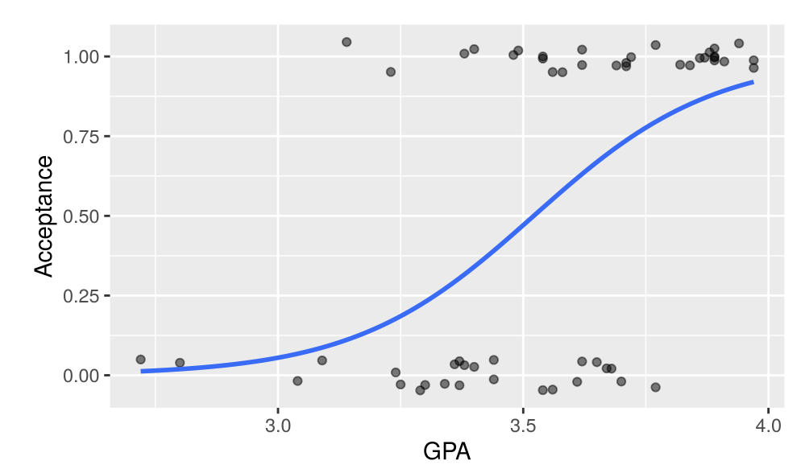
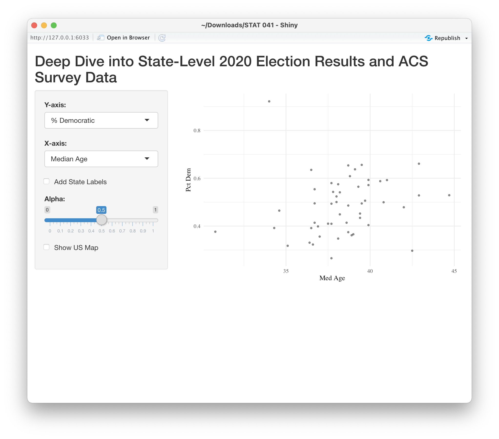

# dataviz-labs

Labs completed for my J-term 2021 (Statistical Graphics and Data Visualization) with Professor Amanda Luby at Swarthmore College.

## Lab 2: Visualizations

[Description](http://www.swarthmore.edu/NatSci/aluby1/stat041/Labs/Lab02.html): Exploring different geoms of ggplot

## Lab 3: Mapmaking

[Description](http://www.swarthmore.edu/NatSci/aluby1/stat041/Labs/Lab03.html): Making maps using 2020 election data

## Lab 4: Customization

[Description](http://www.swarthmore.edu/NatSci/aluby1/stat041/Labs/Lab04.html): Changing fonts, themes, and color palettes

## Lab 5: Linear Regression

[Description](http://www.swarthmore.edu/NatSci/aluby1/stat041/Labs/Lab05-ols.html): Fitting linear regression model to data on COVID-19

## Lab 6: Nonlinear Models

[Description](http://www.swarthmore.edu/NatSci/aluby1/stat041/Labs/Lab06-nonlinear.html): Fitting nonlinear regressions and learning about density plots

## Lab 7: Classification

[Description](http://www.swarthmore.edu/NatSci/aluby1/stat041/Labs/Lab07-classification.html): Learning and fitting logistic regressions

## Lab 8: Time

[Description](http://www.swarthmore.edu/NatSci/aluby1/stat041/Labs/Lab08-time.html): Visualizing data over time and understanding time series

## Lab 9: Plotly and flexdashboard

[Description](http://www.swarthmore.edu/NatSci/aluby1/stat041/Labs/Lab09.html): Interactive plots

Plotly can be found [here](https://rpubs.com/sherr_yh/715269)

flexdashboard can be found [here](https://rpubs.com/sherr_yh/715272)

## Lab 10: Intro to Shiny

[Description](http://www.swarthmore.edu/NatSci/aluby1/stat041/Labs/Lab10.html): Another form of an interactive plot

## Lab 11: Animation

[Description](http://www.swarthmore.edu/NatSci/aluby1/stat041/Labs/Lab11.html): Making animated graphs

HTML file can be found [here](https://rpubs.com/sherr_yh/716154)

## Lab 12: Text

[Description](http://www.swarthmore.edu/NatSci/aluby1/stat041/Labs/Lab12.html): Basic text analysis

